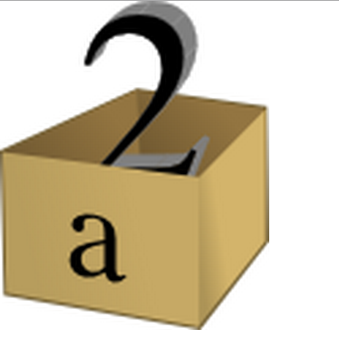

# Koodikoulu

Tervetuloa koodikouluun!

---

## Opet

* Jani Kaarela
* Katja Mankinen
* Niko Viik

---

## Ohjelma

* Esittäytyminen
* Johdanto ohjelmointiin ja Javascriptiin
* Muuttujat ja operaattorit
* Ohjelmointiharjoitus
* T A U K O
* Ehdolliset- ja toistolauseet

---

## Ohjelma (jatkuu)

* Funktiot, parametrit ja paluuarvot
* Ohjelmointiharjoitus
* T A U K O
* Ohjelmointiharjoitus
* Diplomien jako

---

## Materiaali

Tämä presentaatio löytyy osoitteesta:
https://jakaarl.github.io/koodikoulu/

Opiskelumateriaali löytyy täältä:
https://jakaarl.github.io/koodikoulu/materiaalit/

---

## Ohjelmat ja ohjelmointi

* mikä on ohjelma ja ohjelmakoodi?
* missä kaikkialla on ohjelmia?
* mitä ohjelmilla voi tehdä?
* mikä on ohjelmointikieli, mitä ohjelmointikieliä on?
* ketkä niitä ohjelmia oikein kirjoittavat?

---

## Javascript

Ohjelmoimme JavaScriptillä (lyh. JS). Se ei vaadi kummempia työkaluja, sen syntaksi ("kielioppi") on yksinkertainen, ja se on monikäyttöinen.
* tavallinen webbiselain sisältää JS-tulkin
* syntaksi on suhteellisen yksinkertainen...
* ... mutta sillä voi silti tehdä oikeasti hyödyllisiä ja mielenkiintoisia asioita!

---

## Muuttujat

Muuttuja on, kuin laatikko, johon on kirjoitettu päälle nimi tai kuvaus. Se pitää sisällään arvon, johon ohjelmassa voidaan viitata annetulla nimellä:

```
var nimi = "Aku Ankka";
```

Kuten nimi antaa ymmärtää, muuttuja voi muuttua - sen voi asettaa sisältämään jonkin toisen arvon. Muuttujalla ei Javascriptissä ole tiettyä tyyppiä, vaan sen arvoksi voidaan esimerkiksi ensin antaa tekstiä ja myöhemmin numero.

---



---

## Operaattorit

Muuttujia käsitellään operaattoreilla. Edellä yhtäsuuruusmerkillä asetettiin muuttujalle arvo. Operaattoreita löytyy mm. yhteen-, vähennys-, kerto- ja jakolaskuun, sekä vertailuun. Suuri osa operaattoreista toimii vain tietyn tyyppisille muuttujille.

```
var kaksi = 1 + 1; // 2
var tuplanimi = nimi + nimi; // "Aku AnkkaAku Ankka"
```

---

## Ehtolauseet

Ehtolauseen avulla suoritetaan koodia vain, jos jokin ehto on tosi (_true_) - sen ollessa epätosi (_false_), koodia ei suoriteta. Esimerkiksi:

```
if (nimi == "Aku Ankka") {
  console.log("Kääk maailma!");
} else {
  console.log("Hei maailma!");
}
```

Konsoliin lokitetaan "Kääk maailma!" vain siinä tapauksessa, että muuttuja "nimi" on arvoltaan "Aku Ankka". Muuten lokitetaan "Hei maailma!".

---

## Toistolauseet

Myös toistolauseessa on ehto, ja sen ollessa tosi, koodi suoritetaan. Erona on, että koodi suoritetaan toistuvasti, kunnes ehdosta tulee epätosi. Onkin tärkeätä, että ehto muuttuu jossain vaiheessa epätodeksi - muuten koodi juuttuu ikuiseen toistoon (_infinite loop_).

```
var i = 0;
while (i < 5) { // toistetaan niin kauan, kuin i on alle 5!
  i = i + 1;
}
```

---

## Funktiot

Funktio on nimetty koodilohko, joka voi ottaa syötteekseen parametreja ja palauttaa paluuarvon. Funktio suoritetaan vasta, kun sitä kutsutaan.

```
function plus(eka, toka) {
  return eka + toka;
}
```

Funktio "plus" ottaa parametrit "eka" ja "toka", ja palauttaa niiden summan (mikäli ne ovat numeroita) tai liittää ne yhteen (mikäli ne ovat tekstiä).

---

## Objektit

Objekti on tietotyyppi, joka ikään kuin sisältää joukon muuttujia: laatikko, jonka sisällä on muita laatikoita. Sillä voi kätevästi ryhmitellä muuttujia järkeviksi kokonaisuuksiksi.

```
var steve = {
  health: 100,
  armor: [],
  inventory: [],
  equipment_slots: [ null, null, null, null, null, null, null, null, null ],
  active_slot: 0,
  position: {
    x: 11023,
    y: 378,
    z: -12
  }
}
```

---


---

## Kiitos!

Kiitos kärsivällisyydestänne. Lopuksi voidaan vielä harjoitella ohjelmointia pienellä pelillä:
[Pupupeli](https://quiet-brushlands-54755.herokuapp.com/)
